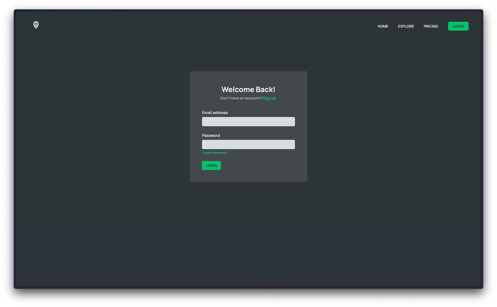

<h1> Waypoint </h1>

Waypoint is a web application designed to help users log and track their travel trips. With a simple and intuitive interface, users can add new trips, view past trips, and manage their travel journey in one place. The app features user authentication and secure data storage using Supabase.

<h2>Features</h2>
<b>Interactive Map</b>: Mark locations worldwide with leaflet map library.  
<b>User Authentication</b>: Sign up and login securely to track your trips and data.  
<b>Trip Management</b>: Add, view, and easily manage your trips. 
<b>Account Management</b>: Create and Update your account securely. 
<b>Real-time Data</b>: Utilizes Supabase for real-time data storage and management, ensuring your trip information is always up to date. 

<h2>Technologies Used</h2>
<b>Frontend</b>: React, JavaScript, HTML, CSS  
<b>Backend</b>: Supabase (for authentication and database management)  
<b>Hosting</b>: Vercel  
<b>Payment</b>: Stripe  

<h1>Screenshots</h1>

<h3>Home Page</h3>

<h3>Explore Page</h3>

<h3>Pricing Page</h3>

<h3>Login</h3>

<h3>Signup</h3>

<h3>Map View</h3>

<h3>Cities List</h3>

<h3>Countries List</h3>

<h3>City Detail View</h3>

<h3>Setting</h3>

<h3>User Stats</h3>

